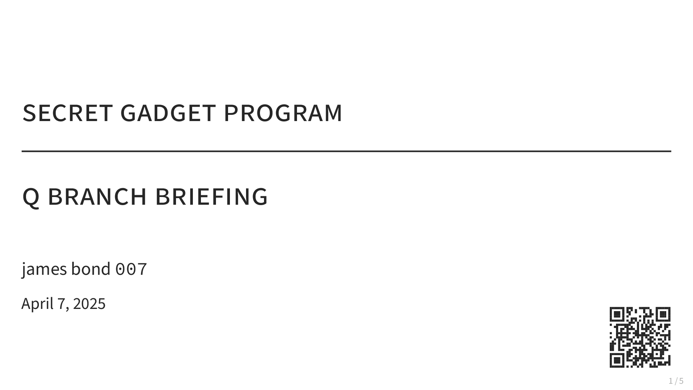

# luhmann.sty

**luhmann.sty** is a simple and sleek LaTeX Beamer style for academic and professional presentations. It builds on [latex-presentation](https://github.com/pmichaillat/latex-presentation) by Pierre-Olivier Michaillat and adds:

- minimalist typographic design  
- lowercase titles and muted color palette  
- QR code integration for slide-sharing  
- consistent math and text fonts  
- widescreen support via `aspectratio=169`  

---

## Preview



---

## Usage

1. Copy `luhmann.sty` into your LaTeX project folder.  
2. Start your Beamer document like this:

    ```latex
    \documentclass[aspectratio=169]{beamer}
    \usepackage{luhmann}

    \title{your title}
    \subtitle{your subtitle}
    \author{your name}
    \date{\today}
    \slidelink{https://example.com/slides}

    \begin{document}

    \frame{\titlepage}

    % your slides here

    \lastslide

    \end{document}
    ```

---

## Example

See [`example.tex`](example.tex) for a minimal working example based on a fictional **James Bond Q-Branch briefing**.  
It includes:

- custom text highlights with `\al`, `\alr`, `\alb`  
- extended list environments (`wideitemize`, `dash`, `subitem`)  
- a summary table of gadgets using `booktabs`  
- a small TikZ schematic of the “pen communicator”  
- layout in 16:9 format using `aspectratio=169`  

To compile:

```bash
latexmk -pdf example.tex
```

---

## Features

- **Fonts**: Source Sans Pro, Source Code Pro, Euler math (via `mathalpha`)  
- **Typography**: half-spacing, microtype, no ligatures  
- **Color scheme**: BielefeldGreen, grayscale tones, semantic alert colors  
- **Lists**: refined itemize/enumerate environments and spacing  
- **Blocks**: styled theorem environments and alert macros  
- **Extras**: QR code for slide link, `\lastslide` placeholder, pictogram shortcuts  

## Citation

If you’d like to cite the style in your presentation or documentation, use:

```bibtex
@misc{luhmann,
    title = {luhmann: A LaTeX Beamer theme},
    author = {Hinz, Julian},
    year = {2025},
    note = {\url{https://julianhinz.com/luhmann}},
}
```

---

## License

MIT

---

## Attribution

Adapted from [latex-presentation](https://github.com/pmichaillat/latex-presentation) by Pierre-Olivier Michaillat.
